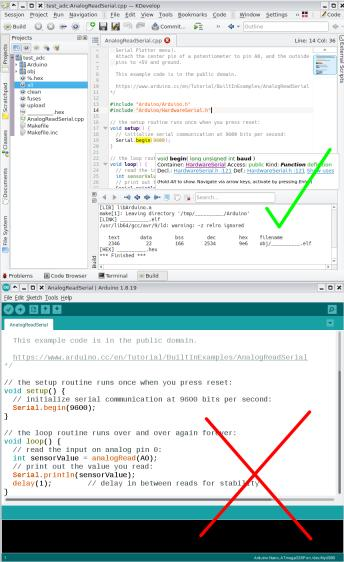

Arduino core as Lib for AVR Boards
===========================================
The Arduino core for Arduino AVR boards, made as a library.
An easy way to use make to build AVR-based arduino sketches.

# What for?
I don't like the Arduino IDE, but sometimes I have to build projects and sketches.
The IDE editor is not at all convenient - you need to use a real powerful-IDE to develop a project.
I think, and you also have questions - why is this a basic notepad?

# How?
I got rid of the arduino preprocessor and am using a regular makefile. From the programmer's point of view, almost nothing has changed - you just need to correctly include the header files.
The file extension needs to be changed from .ino to .cpp.
You can change the board you need in the file Arduino/pins_arduino.h

make all

make clean

make upload

# Dependencies?
If your operating system has build tools for the AVR platform, you don't have to do anything other than do everything
You can download separately and specify the path in Makefile.inc

# Quick links
Copyrights and developments belong to the [Arduino project.](https://github.com/arduino/)

Mirror from [ArduinoCore-avr](https://github.com/arduino/ArduinoCore-avr)
